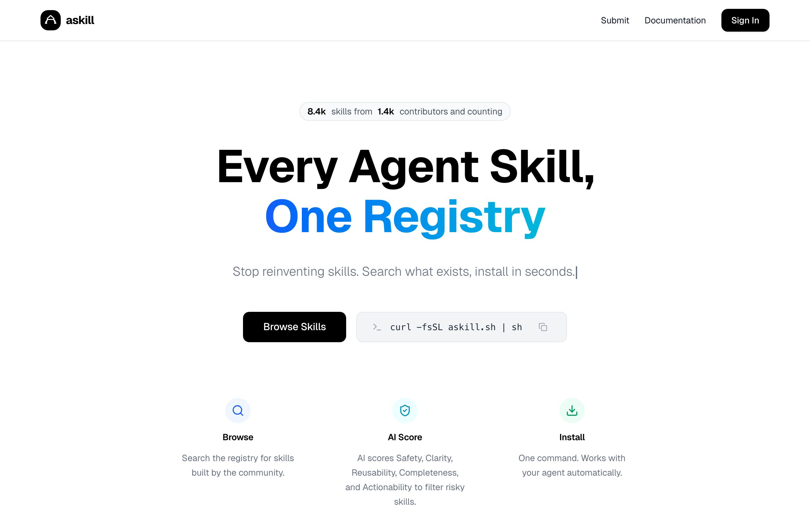
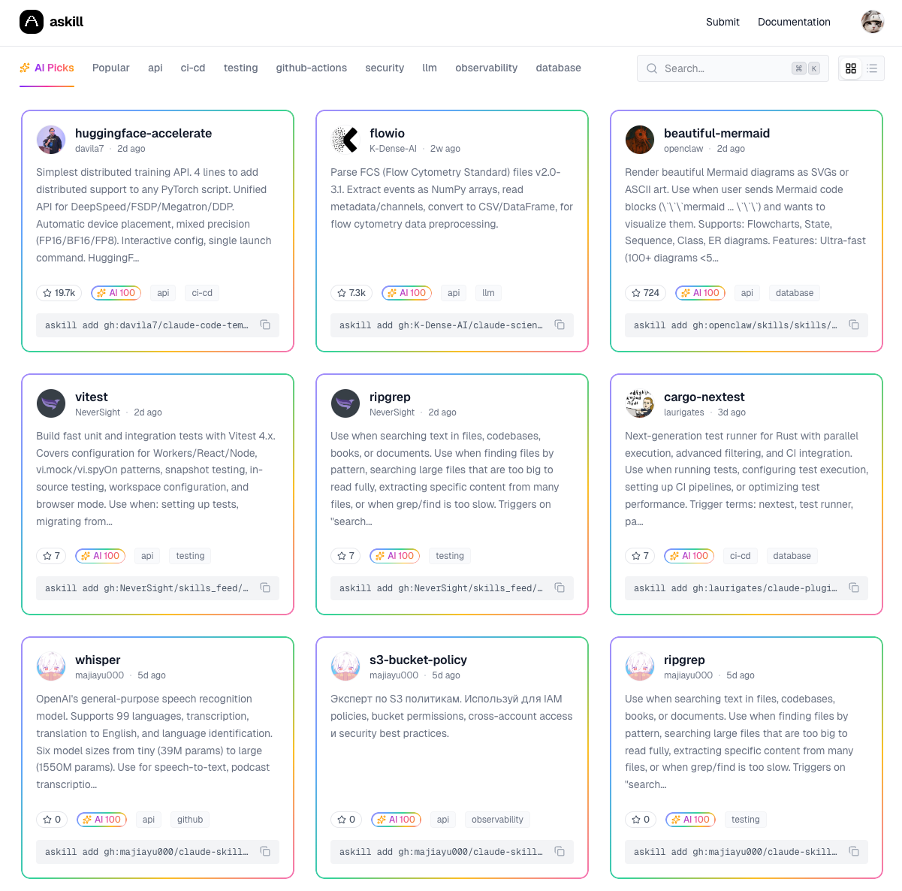
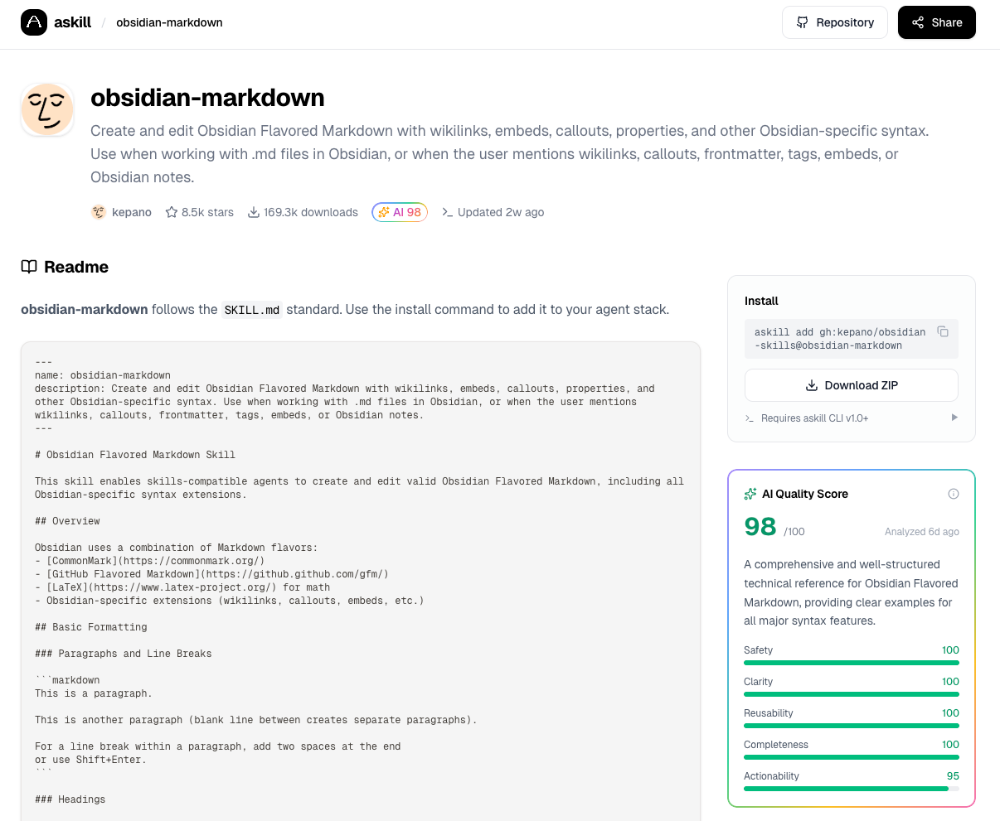
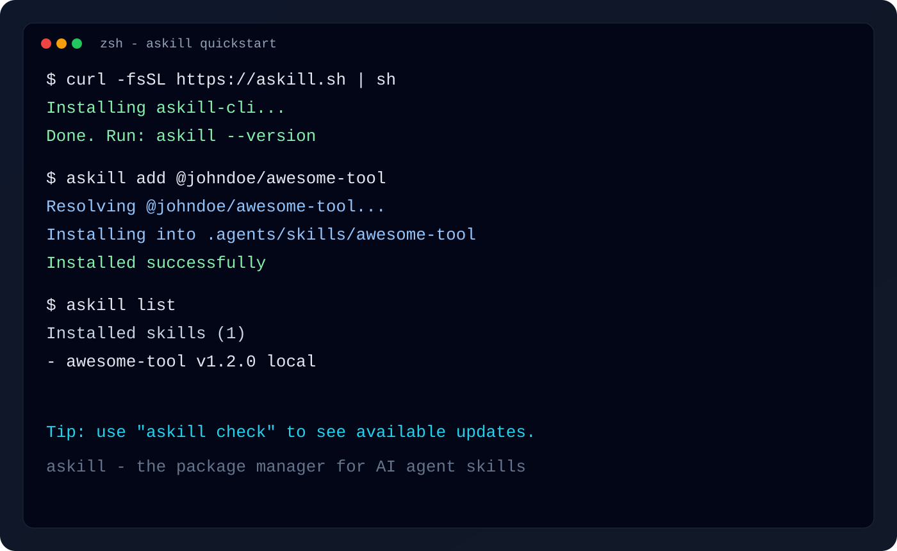
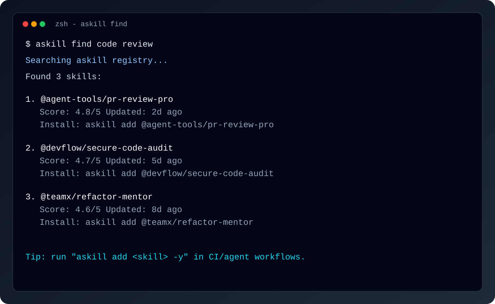
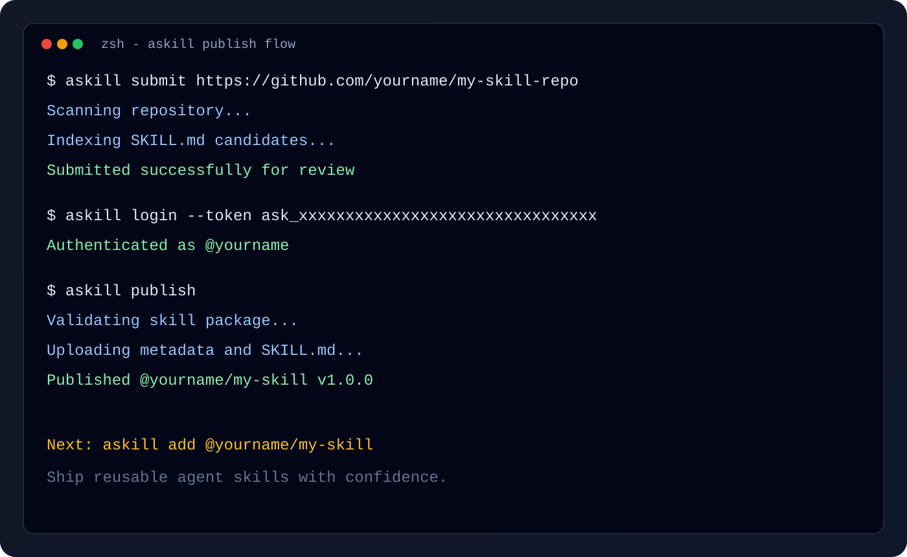

# askill

> The package manager for AI agent skills.

[](https://www.npmjs.com/package/askill-cli)
[](LICENSE)
[](https://nodejs.org)

**Start here: [askill.sh](https://askill.sh) - discover, score, and install agent skills in one place.**

askill is a universal package manager for AI agent skills. It helps agents discover, install, run, and update reusable skills across Claude Code, Codex, OpenCode, OpenClaw, Cursor, and 40+ other AI coding assistants.

Every skill on [askill.sh](https://askill.sh) is automatically reviewed by AI across 5 dimensions: Safety, Clarity, Reusability, Completeness, and Actionability.

## Screenshots

| askill.sh Homepage | Skill Discovery |
|---|---|
|  |  |

| Skill Detail |
|---|
|  |

| Install and list | Search and inspect |
|---|---|
|  |  |

| Publish flow |
|---|
|  |

<details>
<summary><strong>For AI Agents (click to expand)</strong></summary>

You are an AI agent helping a user with askill.

**Quick Commands:**
```bash
# Install a published skill (@author/skill-name)
askill add @johndoe/awesome-tool -y

# Install a skill from GitHub
askill add owner/repo@skill-name -y

# Install all skills from a repo
askill add owner/repo --all -y

# List installed skills
askill list

# Search for skills
askill find <query>

# Submit a GitHub skill URL for indexing
askill submit https://github.com/owner/repo

# Login and publish your own skill
askill login --token ask_xxxxxxxxxxxxxxxxxxxxxxxxxxxxxxxx
askill publish

# Run a skill command
askill run skill-name:command
```

**Key Behaviors:**
- Use `-y` to skip confirmation prompts
- Use `-a <agent>` to target a specific agent (claude-code, cursor, opencode, ...)
- Skills are installed to `.agents/skills/` and symlinked into agent directories
- Installed metadata is saved in `.agents/.skill-lock.json` by default; global installs use `~/.agents/.skill-lock.json`

**For Skill Development:**
- Read [`docs/skill-spec.md`](./docs/skill-spec.md) for SKILL.md format
- Use `askill init` to scaffold a new skill
- Use `askill validate` to check SKILL.md syntax

After installation, read the skill's `SKILL.md` for usage details.

</details>

---

## Quick Start

```bash
# Install
curl -fsSL https://askill.sh | sh

# Install a published skill
askill add @johndoe/awesome-tool

# Search
askill find code review

# List installed skills
askill list
```

## Installation

### One-line install (recommended)

```bash
curl -fsSL https://askill.sh | sh
```

### npm

```bash
npm install -g askill-cli
```

### npx (no global install)

```bash
npx askill-cli add owner/repo@skill-name
```

### Verify

```bash
askill --version
```

## Core Usage

### Install Skills

```bash
# From GitHub repo + skill name
askill add facebook/react@extract-errors

# Browse and select a skill from repo
askill add anthropics/courses

# Install all skills from repo
askill add owner/repo --all

# Non-interactive (CI/agents)
askill add owner/repo@skill -y
```

### Find Skills

```bash
askill find memory
askill find code review
```

### Manage Installed Skills

```bash
# List
askill list
askill list -g

# Check and update
askill check
askill update

# Remove
askill remove skill-name

# Upgrade askill itself
askill upgrade
```

### Machine-readable JSON (Web/Automation)

```bash
# Search skills
askill find memory --json

# List installed skills (all/global/project + agent filter)
askill list --json
askill list -g --json
askill list -p -a opencode --json

# Install skill with explicit scope + agent
askill add owner/repo@skill-name -g -a opencode -y --json

# Remove skill with explicit scope + agent
askill remove skill-name -a opencode --json
```

### Run Skill Commands

```bash
askill run skill-name:command [args]

# Example
askill run memory:save --key name --value "John"
```

## Publish Your Skills

```bash
# 1) Create and test locally
askill init
askill add ./my-skill
askill validate

# 2) Submit repo for indexing
askill submit https://github.com/<owner>/<repo>

# 3) Publish under your author scope
askill login --token ask_xxxxxxxxxxxxxxxxxxxxxxxxxxxxxxxx
askill publish
```

Read the complete guide in [`docs/publishing.md`](./docs/publishing.md).

## Documentation

| Document | Description |
|---|---|
| [Getting Started](./docs/getting-started.md) | Quick start guide |
| [CLI Reference](./docs/cli-reference.md) | Full command reference |
| [Integrating askill CLI](./docs/integrating-askill-cli.md) | Build Web/desktop/service integrations with `askill --json` |
| [JSON Contracts](./docs/json-contracts/README.md) | Validate `askill --json` responses with official schemas |
| [SKILL.md Specification](./docs/skill-spec.md) | How to write high-quality skills |
| [Publishing Guide](./docs/publishing.md) | Submit and publish workflow |

## Contributing

Contributions are welcome. See [CONTRIBUTING.md](./CONTRIBUTING.md) for development setup and contribution workflow.

## License

MIT License - see [LICENSE](./LICENSE).

---

**Website**: [askill.sh](https://askill.sh)  
**npm**: [askill-cli](https://www.npmjs.com/package/askill-cli)  
**GitHub**: [avibe-bot/askill](https://github.com/avibe-bot/askill)
